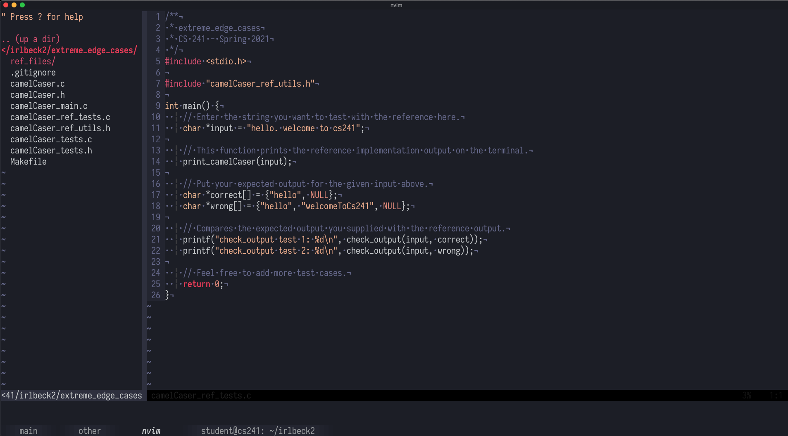
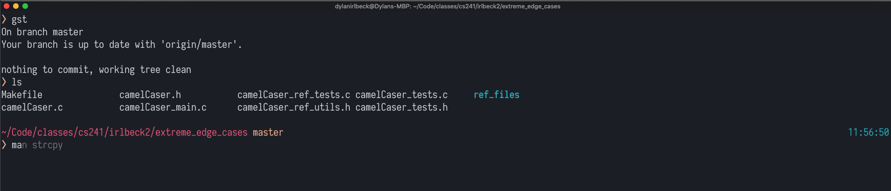

# dotfiles (experimental)

This is a collection of neovim, zsh, and kitty configurations. These dotfiles are how _I_ like to do things, and may or may not be useful to you. I'm constantly changing these and am very much open to suggestions, so please open an issue if you have ideas!

 

## Features (main)

The following are the main reason I created my dotfiles. For an extended list of everything inside these dotfiles, see [here](#features-extended)

- [Neovim](https://neovim.io/) - A refactor of Vim with better plugin support
- [Zsh](https://en.wikipedia.org/wiki/Z_shell) - Better Unix shell
- [Kitty](https://sw.kovidgoyal.net/kitty/) - GPU based terminal emulator

## Getting Started

First, download the following tools.

- [Neovim](https://github.com/neovim/neovim/wiki/Installing-Neovim)
- [Zsh and Oh-My-Zsh](https://github.com/ohmyzsh/ohmyzsh/wiki/Installing-ZSH)
- [Kitty](https://sw.kovidgoyal.net/kitty/#quickstart)

Clone the project.

```
git clone https://github.com/dylanirlbeck/dotfiles.git ~/dotfiles
```

For dotfile management I use [dotbot](https://github.com/anishathalye/dotbot).
Running the following should establish the right symlinks; you may have to
delete a few files to get it working, but instructions to do so should show up
accordingly.

```
./install
```

> Note that I don't recommend blindly copying dotfiles from anyone, including me. A better approach is to pull pieces of what want and build up your own dotfiles iteratively (so you actually understand what's going on!).

## Neovim setup

From this point on, you'll need to install [VimPlug](https://github.com/junegunn/vim-plug) for plugin management. After doing so, run `:PlugInstall` inside of Neovim to install the proper plugins.

### OCaml/Reason

Things you'll need:
* [esy](esy.sh)
* [ocamlformat](https://github.com/ocaml-ppx/ocamlformat)
* [opam](http://opam.ocaml.org/doc/Install.html) with OCaml version 4.06.1 installed

> Note that my setup doesn't work for editing a standalone Reason file (it does support editing a standalone OCaml file). For linting/formatting and language server support, will want to edit your files inside a BuckleScript or Reason native project. 

## Features Extended

The features marked with `TODO` will soon be added to my Github-hosted dotfiles.

- Neovim (coc.nvim, optimized for reason/ocaml development)
- Zsh
- Kitty
- [Powerlevel10k](https://github.com/romkatv/powerlevel10k)
- Fzf (TODO)
- Homebrew (TODO)
- Mac OS Setup (TODO)

Some other random things I use on a day-to-day basis:

- Alfred
- Spectacle (though this will likely be replaced soon)
- Flux
- Firefox (with the Vim and GitHub dark mode extensions)

## Stuff I'm actively considering or want to investigate

- Onivim2
- tmux
- hammerspoon
- prezto
